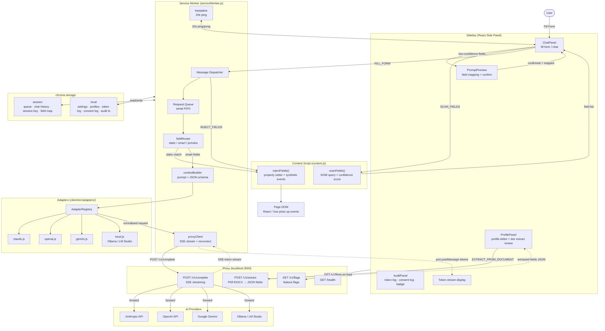

# AI Form Assistant

A Chrome extension (Manifest V3) that uses AI to detect and fill web forms using your saved profile. Supports Claude, OpenAI, Gemini, and local models via Ollama/LM Studio.

This is a single npm-workspaces monorepo with two independently-deployed halves — `client/` (the extension) and `server/` (the Express proxy) — plus `shared/` (`@aifa/contract`), the wire contract both import so they can't drift apart. One `npm install` at the root installs everything.

## Architecture



> Solid arrows = direct calls/messages. Dashed arrows = streaming data / async responses.

## Folder structure

```
ai-form-assistant/                 ← workspace root (private, no app code)
├── package.json                   ← workspaces: [client, server, shared] + run scripts
├── readme.md
├── CLAUDE.md                      ← guidance for Claude Code
│
├── shared/                        ← @aifa/contract — wire contract shared by client + server
│   ├── package.json
│   └── contract.js                ← PROVIDERS, ENDPOINTS, SSE sentinels
│
├── client/                        ← the Chrome extension
│   ├── manifest.json              ← Chrome MV3 manifest
│   ├── vite.config.ts             ← crxjs build config (multi-entry); outputs to ../dist
│   ├── package.json
│   ├── icons/                     ← icon16/48/128.png
│   ├── scripts/
│   │   └── gen-icons.mjs          ← generates placeholder PNG icons (no deps)
│   └── src/
│       ├── shared/
│       │   ├── constants.js       ← models, storage keys, cost table, MSG types (re-exports @aifa/contract)
│       │   ├── crypto.js          ← AES-GCM session-key encrypt/decrypt (Web Crypto API)
│       │   ├── storage.js         ← typed wrappers for chrome.storage.local + .session
│       │   ├── requestQueue.js    ← serial FIFO queue in chrome.storage.session
│       │   └── consentGate.js     ← consent event logging (capped at 200 entries)
│       │
│       ├── adapters/
│       │   ├── index.js           ← AdapterRegistry (Open/Closed)
│       │   ├── claude.js
│       │   ├── openai.js
│       │   ├── gemini.js
│       │   └── local.js           ← Ollama / LM Studio, configurable port
│       │
│       ├── worker/
│       │   ├── serviceWorker.js   ← MV3 orchestrator
│       │   ├── keepalive.js       ← 20s ping to prevent SW suspension during streaming
│       │   ├── proxyClient.js     ← SSE streaming, reconnect, __usage__ parsing
│       │   ├── contextBuilder.js  ← assembles prompt + JSON schema
│       │   ├── fieldRouter.js     ← static / smart / preview routing (confidence-based)
│       │   └── errorHandler.js    ← normalises all errors to { code, message, retryable, ... }
│       │
│       ├── content/
│       │   ├── content.js         ← self-contained IIFE; idempotency-guarded
│       │   ├── fieldScanner.js    ← DOM field discovery + confidence scoring
│       │   └── fieldInjector.js   ← property setter injection + synthetic events
│       │
│       ├── sidebar/
│       │   ├── index.html
│       │   ├── index.css
│       │   ├── main.jsx
│       │   ├── App.jsx            ← tab shell (Chat / Profile / Settings / Audit) + audit badge
│       │   ├── hooks/
│       │   │   └── useFeatureFlags.js  ← merges hardcoded → remote /v1/flags → local overrides
│       │   └── components/
│       │       ├── ChatPanel.jsx       ← conversation, fill form, streaming
│       │       ├── PromptPreview.jsx   ← field mapping + confirm before AI call
│       │       ├── ProfilePanel.jsx    ← section editor, templates, doc extraction review UI
│       │       ├── SettingsPanel.jsx   ← routes to sub-sections below
│       │       ├── AuditPanel.jsx      ← tabs: token usage, consent log, clear data
│       │       ├── CostBadge.jsx       ← inline token count + estimated cost
│       │       │
│       │       ├── settings/
│       │       │   ├── AiProviderSection.jsx      ← provider/model picker
│       │       │   ├── ProxySection.jsx            ← proxy URL + connection test
│       │       │   ├── FeaturesSection.jsx         ← feature flag toggles
│       │       │   └── ProfileSectionsSection.jsx  ← show/hide each profile section
│       │       │
│       │       ├── audit/
│       │       │   ├── TokenUsageTab.jsx   ← per-call token/cost breakdown
│       │       │   ├── ConsentLogTab.jsx   ← masked field fill audit trail
│       │       │   ├── PrivacySection.jsx  ← "Clear all data" control
│       │       │   └── auditUtils.js       ← fmt() / mask() helpers
│       │       │
│       │       └── sections/               ← one component per profile section
│       │           ├── profileFieldConfigs.js        ← all field definitions (edit here to add fields)
│       │           ├── SectionCustomFieldsAddon.jsx  ← reusable per-section custom fields
│       │           ├── PersonalInfoSection.jsx
│       │           ├── EmployeeInfoSection.jsx
│       │           ├── EducationInfoSection.jsx
│       │           ├── JudgingSection.jsx
│       │           ├── MentoringSection.jsx
│       │           ├── SpeakerSection.jsx
│       │           ├── ScholarshipSection.jsx
│       │           ├── ProfessionalAccountsSection.jsx
│       │           ├── DocumentsSection.jsx
│       │           └── CustomFieldsSection.jsx
│       │
│       └── options/
│           ├── index.html
│           ├── main.jsx
│           └── App.jsx            ← full-page config (reuses sidebar panels)
│
└── server/                        ← the Express proxy (localhost:3000)
    ├── package.json               ← express + cors + cross-env + pdf-parse + mammoth
    ├── index.js                   ← app startup, route mounting
    ├── config.js                  ← env config, feature flag parser, API key loader
    ├── lib/
    │   ├── requestBuilder.js      ← per-provider request normalisation
    │   ├── streaming.js           ← SSE pipe helpers
    │   ├── mock.js                ← fake SSE responses for MOCK mode
    │   └── utils.js               ← error/JSON helpers
    └── routes/
        ├── complete.js            ← POST /v1/complete (SSE streaming to AI providers)
        ├── extract.js             ← POST /v1/extract (PDF/DOCX → JSON field extraction)
        ├── flags.js               ← GET  /v1/flags  (operator-controlled feature flags)
        └── health.js              ← GET  /health    (status check)
```

## Setup

All commands run from the repo root.

```bash
# 1. Install all workspaces (client, server, shared)
npm install

# 2. Generate placeholder icons (one-time, already committed)
npm run gen-icons

# 3. Build extension (watch mode for dev) → ./dist/
npm run dev

# 4. Start proxy in MOCK mode (no API keys needed)
npm run proxy:mock
# If you get EADDRINUSE (port 3000 already in use), a previous proxy is still running.
# Find and kill it:
#   Windows:  Get-NetTCPConnection -LocalPort 3000 | Select OwningProcess | Stop-Process -Force
#   macOS:    lsof -ti:3000 | xargs kill

# 5. Load in Chrome
# chrome://extensions → Developer mode → Load unpacked → select ./dist/
```

## First run checklist

- [ ] Extension loaded from `./dist/`
- [ ] Proxy running on `localhost:3000` (`npm run proxy:mock` from root)
- [ ] Open sidebar → Settings → Test connection → shows ✓
- [ ] Navigate to any form page → Chat → Fill form → fields detected and filled
- [ ] (Optional) Replace `icons/*.png` with real artwork (16×16, 48×48, 128×128)

## Profile sections

ProfilePanel exposes up to 11 independently toggle-able sections (Settings → Profile Sections):

| Section | Feature flag | Key fields |
|---------|-------------|------------|
| Personal Info | `personalSection` | name, pronouns, email, phone, address, bio, password |
| Employment | `employmentSection` | job title, company, experience, LinkedIn, skills, cover letter |
| Education | `educationSection` | degree, field of study, school, graduation year, GPA |
| Judging | `judgingSection` | role, organization, domain, year, notes |
| Mentoring | `mentoringSection` | role, organization, focus, availability, bio |
| Speaker | `speakerSection` | topics, events, bio, honorarium, website, video |
| Scholarship | `scholarshipSection` | org, school, level, GPA, personal statement, financial need |
| Professional Accounts | `professionalAccountsSection` | LinkedIn, Twitter/X, GitHub, Instagram, YouTube, Portfolio |
| Documents | `documentsSection` | PDF/DOCX uploads → base64 for AI context |
| Custom Fields | `customFieldsSection` | user-defined label → key pairs (global scope) |

Every section also supports adding arbitrary section-scoped custom fields via `SectionCustomFieldsAddon`. Keys are namespaced `<sectionId>__<customKey>` (e.g., `employment__certifications`).

## Feature flags

Flags flow through three layers; later layers win:

1. **Hardcoded defaults** — `DEFAULT_SETTINGS.features` in `client/src/shared/constants.js`
2. **Remote flags** — fetched from proxy `GET /v1/flags` at sidebar load (operator control via `server/config.js`)
3. **Local overrides** — saved by the user via Settings → Features / Profile Sections

`client/src/sidebar/hooks/useFeatureFlags.js` performs the merge.

Notable flags: `costBadge`, `auditPanel`, `attachmentFilling` (embed document text in AI prompt), plus one flag per profile section.

## Proxy

The proxy (`server/`) runs on `localhost:3000` and forwards requests to the AI provider. This avoids CORS issues and keeps API keys off the extension. Run it from the repo root:

```bash
# Real mode (needs API key set in sidebar Settings or server/.env)
npm run proxy

# Mock mode (returns fake streaming responses, no API key needed)
npm run proxy:mock
```

### Endpoints

| Method | Path | Description |
|--------|------|-------------|
| GET | `/health` | Returns `{ ok: true }` |
| POST | `/v1/complete` | SSE streaming completion — proxies to Claude / OpenAI / Gemini / Ollama |
| POST | `/v1/extract` | Decodes base64 PDF or DOCX, returns JSON with up to 23 profile fields; body limit 10 MB |
| GET | `/v1/flags` | Returns operator-controlled feature flag object |

> `.doc` files are not supported by `/v1/extract`; use `.pdf` or `.docx`.

## Adding a new AI provider

1. Create `client/src/adapters/myprovider.js` exporting `normalise()` and `parseUsage()`
2. Add one line in `client/src/adapters/index.js`: import and register in the registry object
3. Add models to `MODELS` and `COST_TABLE` in `client/src/shared/constants.js`

No other files need to change.

## Adding a new profile section

1. Create `client/src/sidebar/components/sections/MySection.jsx` (follow any existing section as a template)
2. Add field definitions to `profileFieldConfigs.js`
3. Add a feature flag default (`mySection: true`) to `DEFAULT_SETTINGS.features` in `constants.js`
4. Add the flag toggle to `ProfileSectionsSection.jsx`
5. Import and render the section in `ProfilePanel.jsx` gated by `features.mySection`
6. Add the flag key to `server/config.js` `FEATURE_FLAGS`

## Key architecture decisions

| Decision | Choice |
|----------|--------|
| Build | Vite 5 + `@crxjs/vite-plugin` beta.23 (MV3 multi-entry) |
| Storage hot path | `chrome.storage.session` (no rate limit, session lifetime) |
| Storage persistence | `chrome.storage.local` (120 writes/min — coalesced in storage.js) |
| API key security | AES-GCM 256-bit session key via Web Crypto API, never stored plaintext |
| Repo layout | npm-workspaces monorepo: `client/` + `server/` + shared `@aifa/contract` |
| Concurrency guard | Serial FIFO request queue in `chrome.storage.session` |
| Provider extensibility | AdapterRegistry — Open/Closed principle |
| Feature flags | 3-layer merge: hardcoded defaults → remote `/v1/flags` → local user overrides |
| Content script safety | Idempotency guard (`window.__aiFormAssistantLoaded`) prevents duplicate listeners |
| Error handling | Normalised `{ code, message, retryable, provider, timestamp }` shape throughout |
| Permissions | `activeTab` on-demand, `host_permissions` scoped to `localhost:3000` + `<all_urls>` |
| SW keepalive | 20s port ping prevents MV3 service worker suspension during SSE streaming |
| Document extraction | Server-side pdf-parse + mammoth; client shows diff review before applying fields |
