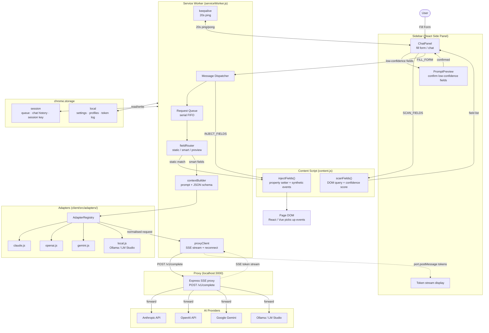

# AI Form Assistant

A Chrome extension (Manifest V3) that uses AI to detect and fill web forms using your saved profile. Supports Claude, OpenAI, Gemini, and local models via Ollama/LM Studio.

This is a single npm-workspaces monorepo with two independently-deployed halves — `client/` (the extension) and `server/` (the Express proxy) — plus `shared/` (`@aifa/contract`), the wire contract both import so they can't drift apart. One `npm install` at the root installs everything.

## Architecture



> Solid arrows = direct calls/messages. Dashed arrows = streaming data (SSE tokens).

## Folder structure

```
ai-form-assistant/                 ← workspace root (private, no app code)
├── package.json                   ← workspaces: [client, server, shared] + run scripts
├── README.md
│
├── shared/                        ← @aifa/contract — wire contract shared by client + server
│   ├── package.json
│   └── contract.js                ← PROVIDERS, ENDPOINTS, SSE sentinels
│
├── client/                        ← the Chrome extension
│   ├── manifest.json              ← Chrome MV3 manifest
│   ├── vite.config.ts             ← crxjs build config (multi-entry); outputs to ../dist
│   ├── package.json
│   ├── icons/                     ← icon16/48/128.png
│   ├── scripts/
│   │   └── gen-icons.mjs          ← generates placeholder PNG icons (no deps)
│   └── src/
│       ├── shared/
│       │   ├── constants.js       ← models, storage keys, cost table, message types (re-exports @aifa/contract)
│       │   ├── crypto.js          ← AES-GCM session-key encrypt/decrypt (Web Crypto API)
│       │   ├── storage.js         ← typed wrappers for chrome.storage.local + .session
│       │   ├── requestQueue.js    ← serial FIFO queue in chrome.storage.session
│       │   └── consentGate.js     ← consent event logging (capped at 200 entries)
│       │
│       ├── adapters/
│       │   ├── index.js           ← AdapterRegistry (Open/Closed)
│       │   ├── claude.js
│       │   ├── openai.js
│       │   ├── gemini.js
│       │   └── local.js           ← Ollama / LM Studio, configurable port
│       │
│       ├── worker/
│       │   ├── serviceWorker.js   ← MV3 orchestrator
│       │   ├── keepalive.js       ← 20s ping to prevent SW suspension during streaming
│       │   ├── proxyClient.js     ← SSE streaming, reconnect, __usage__ parsing
│       │   ├── contextBuilder.js  ← assembles prompt + JSON schema
│       │   ├── fieldRouter.js     ← static / smart / preview routing (confidence-based)
│       │   └── errorHandler.js    ← normalises all errors to ErrorEvent shape
│       │
│       ├── content/
│       │   └── content.js         ← self-contained IIFE (no ES imports); idempotency-guarded
│       │
│       ├── sidebar/
│       │   ├── index.html
│       │   ├── index.css
│       │   ├── main.jsx
│       │   ├── App.jsx            ← tab shell, context strip, keepalive port
│       │   └── components/
│       │       ├── ChatPanel.jsx       ← conversation, fill form, streaming
│       │       ├── PromptPreview.jsx   ← review fields before AI call
│       │       ├── ProfilePanel.jsx    ← saved fields, templates
│       │       ├── SettingsPanel.jsx   ← provider, model, API key, proxy, LLM port
│       │       ├── AuditPanel.jsx      ← privacy, consent log, token history, clear data
│       │       └── CostBadge.jsx       ← inline token count + estimated cost
│       │
│       └── options/
│           ├── index.html
│           ├── main.jsx
│           └── App.jsx            ← full-page config (reuses sidebar components)
│
└── server/                        ← the Express proxy (localhost:3000)
    ├── package.json               ← express + cors + cross-env
    ├── index.js                   ← app startup, route mounting
    ├── config.js                  ← env + feature flags
    ├── lib/                       ← requestBuilder, streaming (SSE pipe), mock, utils
    └── routes/                    ← complete, extract, flags, health
```

## Setup

All commands run from the repo root.

```bash
# 1. Install all workspaces (client, server, shared)
npm install

# 2. Generate placeholder icons (one-time, already committed)
npm run gen-icons

# 3. Build extension (watch mode for dev) → ./dist/
npm run dev

# 4. Start proxy in MOCK mode (no API keys needed)
npm run proxy:mock
# If you get EADDRINUSE (port 3000 already in use), a previous proxy is still running.
# Find and kill it:
#   Windows:  Get-NetTCPConnection -LocalPort 3000 | Select OwningProcess | Stop-Process -Force
#   macOS:    lsof -ti:3000 | xargs kill

# 5. Load in Chrome
# chrome://extensions → Developer mode → Load unpacked → select ./dist/
```

## First run checklist

- [ ] Extension loaded from `./dist/`
- [ ] Proxy running on `localhost:3000` (`npm run proxy:mock` from root)
- [ ] Open sidebar → Settings → Test connection → shows ✓
- [ ] Navigate to any form page → Chat → Fill form → fields detected and filled
- [ ] (Optional) Replace `icons/*.png` with real artwork (16×16, 48×48, 128×128)

## Adding a new AI provider

1. Create `client/src/adapters/myprovider.js` exporting `normalise()` and `parseUsage()`
2. Add one line in `client/src/adapters/index.js`: `import myprovider from './myprovider.js'`
3. Add the key to the `registry` object
4. Add models to `MODELS` in `client/src/shared/constants.js`

No other files need to change.

## Key architecture decisions

| Decision | Choice |
|----------|--------|
| Build | Vite 5 + `@crxjs/vite-plugin` beta.23 (MV3 multi-entry) |
| Storage hot path | `chrome.storage.session` (no rate limit, session lifetime) |
| Storage persistence | `chrome.storage.local` (120 writes/min — coalesced in storage.js) |
| API key security | AES-GCM 256-bit session key via Web Crypto API, never stored plaintext |
| Repo layout | npm-workspaces monorepo: `client/` + `server/` + shared `@aifa/contract` |
| Concurrency guard | Serial FIFO request queue in `chrome.storage.session` |
| Provider extensibility | AdapterRegistry — Open/Closed principle |
| Content script safety | Idempotency guard (`window.__aiFormAssistantLoaded`) prevents duplicate listeners |
| Error handling | Normalised `ErrorEvent` shape throughout |
| Permissions | `activeTab` on-demand, `host_permissions` scoped to `localhost:3000` only |
| SW keepalive | 20s port ping prevents MV3 service worker suspension during SSE streaming |

## Proxy

The proxy (`server/`) runs on `localhost:3000` and forwards requests to the AI provider. This avoids CORS issues and keeps API keys off the extension. Run it from the repo root:

```bash
# Real mode (needs API key set in sidebar Settings or server/.env)
npm run proxy

# Mock mode (returns fake streaming responses, no API key needed)
npm run proxy:mock
```

The proxy exposes:
- `POST /v1/complete` — SSE streaming endpoint
- `GET /health` — returns `{ ok: true }`
